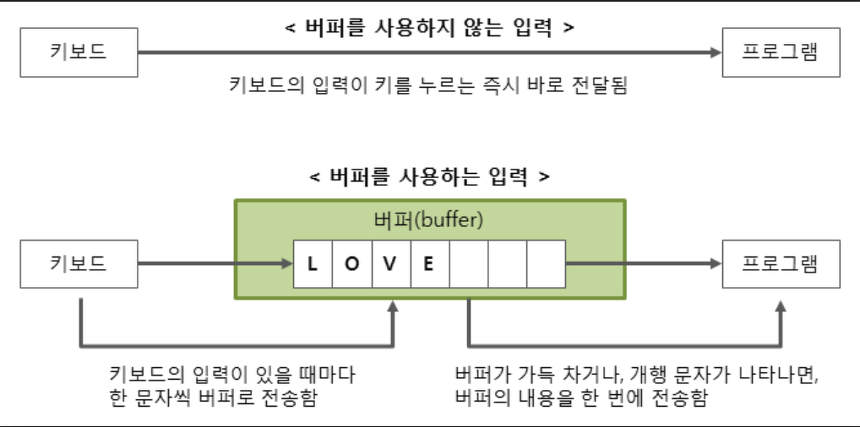
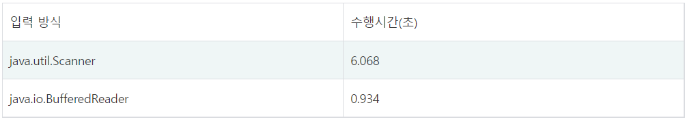

# BufferedReader / BufferedWriter
BufferedReader와 BufferdWriter는 버퍼를 사용하여 읽기와 쓰기를 하는 함수이다.
버퍼를 사용하지 않는 입력은, 키보드의 입력이 키를 누르는 즉시 바로 프로그램에 전달된다.

반면 버퍼를 사용하는 입력은, 키보드의 입력이 있을 때마다 한 문자씩 버퍼로 전송한다. 버퍼가 가득 차거나 혹은 개행 문자가 나타나면 버퍼의 내용을 한 번에 프로그램에 전달한다.

한번 버퍼를 거쳐 출력되는 것보다, 키보드의 입력을 받는 즉시 출력하는 것이 더 빠른 것이 아닌가 생각할수 있다.

하드디스크는 속도가 느리다. 그리고 외부 장치(키보드, 모니터 등)와 데이터 입출력도 생각보다 시간이 오래 걸린다. 그렇기 때문에 키보드의 입력이 있을 때마다 바로 이동시키는 것 보다는, 중간에 버퍼를 두어 한번에 묶어 보내는 것이 더 효율적이고 빠른 방법이다.

## Scanner
BufferdReader 를 보기 전에 먼저 Scanner를 살펴보자.

대부분 Java를 처음 배울때, Scanner를 통한 입출력을 먼저 배우게 될 것이다.

Scanner는 띄어쓰기와 개행문자를 경계로 하여 입력 값을 인식한다. 그렇기 때문에 따로 가공할 필요가 없어 편리하다.

가공할 필요가 없다는 뜻은, 가령 int형 변수를 입력 받고자 하면, int x = scanner.nextInt() 를 사용해 바로 원하는 타입의 입력을 받을 수 있다. 하지만 다음에 살펴볼 BufferedReader은 입력 받은 데이터가 String으로 고정되기 때문에 입력받은 데이터를 원하는 타입으로 가공하는 작업이 필요하다.

Scanner는 지원해주는 메소드가 많고, 사용하기 쉽기 때문에 많이 사용하지만, 버퍼 사이즈가 1024 char이기 때문에

많은 입력을 필요로 할 경우에는 성능상 좋지 못한 결과를 불러온다.

## BufferedReader
Scanner와 달리 BufferedReader는 개행문자만 경계로 인식하고 입력받은 데이터가 String으로 고정된다. 그렇기 때문에 따로 데이터를 가공해야하는 경우가 많다. 하지만 Scanner보다 속도가 빠르다!

BufferedRead와 Scanner의 속도 차이를 잘 보여주는 예시가 있어 가져와 보았다.

10,000,000개의 0~1023 범위의 정수를 한 줄씩 읽고, 입력으로 받은 정수의 합을 출력하는 프로그램을 각각 BufferedReader와 Scanner로 구현할 때의 수행시간이다.

그리고 버퍼 사이즈도 Scanner가 1024 char인데 비해, BufferedReader는 8192 char(16,384byte) 이기 때문에 입력이 많을 때 BufferedReader가 유리하다.

또한 BufferedReader는 동기화 되기 때문에 멀티 쓰레드 환경에서 안전하고, Scanner는 동기화가 되지 않기 때문에 멀티 쓰레드 환경에서 안전하지 않다.  

---
출처 : https://rlakuku-program.tistory.com/33